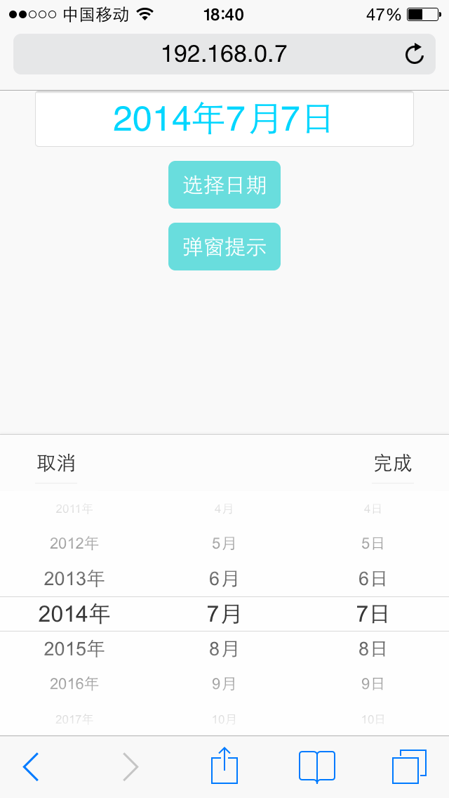
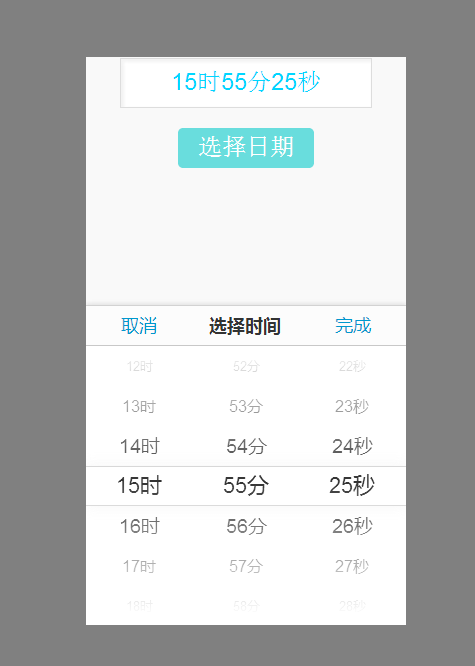

<h2>这个一个移动设备日期选择组件</h2>

<h4>组件基于jQuery和jQuery Touch</h4>

实例：
<pre>

	<input type="text" id="date" readonly class="date-input">
	/**
	 * 创建日期选择组件实例
	 * @param  'date' // data为输入框的id值
	 * this.currDate // 获取当前返回的日期数组 [2014, 7, 7]
	 * this.getCurrentDate(0,0,0) // 获取指定的日期，如果参数为0，则返回当前对应的值
	 */
	var appDateField = new APPDateField('date', {

	    isCN: true,       //是否显示中文, 如: " 2014年4月1日 "
	    commer: '/',      //期间之间的间隔符, 默认为 "/"，当 isCN为 true时, 这个设置失效
	    showYear: true,   //是否显示年份, 默认为显示 （true）
	    showMonth: true,  //是否显示月份, 默认为显示 （true）
	    showDate: true,   //是否显示日, 默认为显示 （true）
	    showTime: true,     //是否组件为时间选择，true：'16:20:25' 如果isCN为true，则："16时20分25秒".这个开启建议将isCN设置为false
	    complate: function(evt){  // "完成"按钮触发事件
	        console.log(this)
	        console.log(this.getCurrentDate(0,0,0));
	        console.log(this.currDate);
	        //alert(999)
	    },
	    cancel: function(evt){  // "取消"按钮触发事件
	        console.log('Cancel---');
	    }

	});
</pre>

	
	

