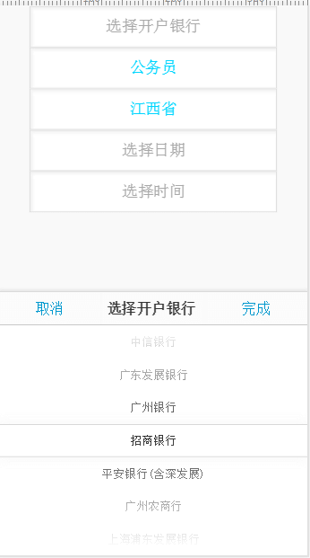
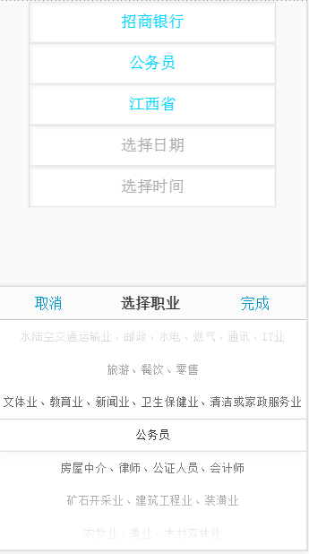
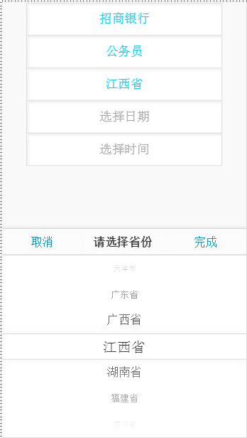
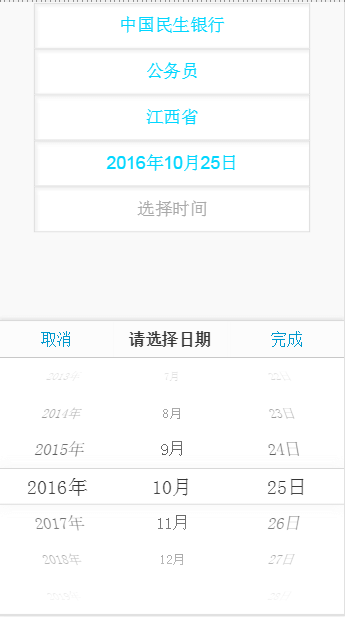
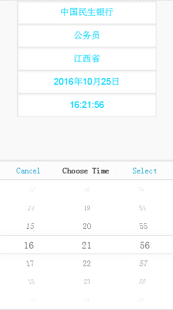

<h2>这个一个移动设备选择组件(日期选择|数据选择)</h2>

<h4>组件基于Zepto|jQuery</h4>

实例：
<pre>

	&lt;input type="text" id="date" readonly class="date-input"&gt;
	/**
	 * 创建日期选择组件实例
	 * @param  'date' // data为输入框的id值
	 */
	var appDateField = new APPDateField('date', {

	    isCN: true,       //是否显示中文, 如: " 2014年4月1日 "
	    commer: '/',      //期间之间的间隔符, 默认为 "/"，当 isCN为 true时, 这个设置失效
	    complate: function(evt){  // "完成"按钮触发事件
	        console.log(this)
	        console.log(this.currDate);
	    },
	    cancel: function(evt){  // "取消"按钮触发事件
	        console.log('Cancel---');
	    }

	});
</pre>

    
    
    
    
    

<h2>Options</h2>
<ul class="options">
    <li> <code>upYear:</code> 上限年份 </li>
    <li> <code>downYear:</code> 下限年份 </li>
    <li> <code>data:</code> 选择数据，自定义数据选择，相当于select标签 </li>
    <li> <code>title:</code> 标题 </li>
    <li> <code>addClass:</code> 对象层需要添加的class </li>
    <li> <code>fontSize:</code> 列表字体大小 </li>
    <li> <code>cancelTxt:</code> 取消按钮文字，默认： '取消' </li>
    <li> <code>completeTxt:</code> 确认按钮文字，默认： '完成' </li>
    <li> <code>complete:</code> 点击确认后回调 </li>
    <li> <code>cancel:</code> 点击取消后回调 </li>
    <li> <code>moveEnd:</code> 滑动停止后回调 </li>
    <li> <code>isCN:</code> 为日期时间选择时，是否显示中文，默认： true </li>
    <li> <code>isCircle:</code> 是否设置凸镜效果，默认： true </li>
    <li> <code>showYear:</code> 是否显示年份，默认： true </li>
    <li> <code>showMonth:</code> 是否显示月份，默认： true </li>
    <li> <code>showDate:</code> 是否显示日，默认： true </li>
    <li> <code>showTime:</code> 是否为时间选择器，默认： false </li>
    <li> <code>commer:</code> 日期间隔，默认 ‘-’，（当isCN为true时，无效） </li>
</ul>
